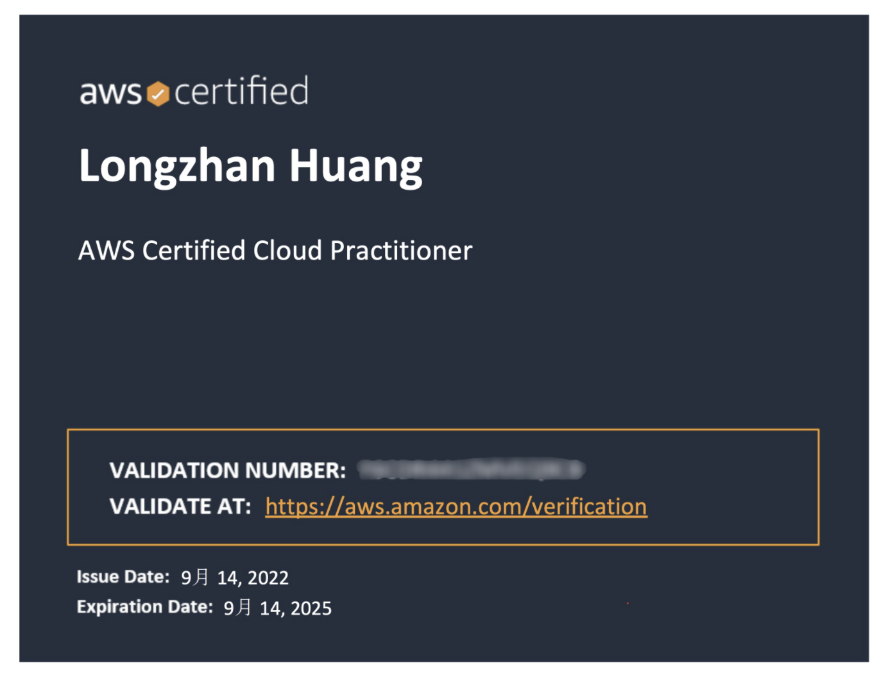
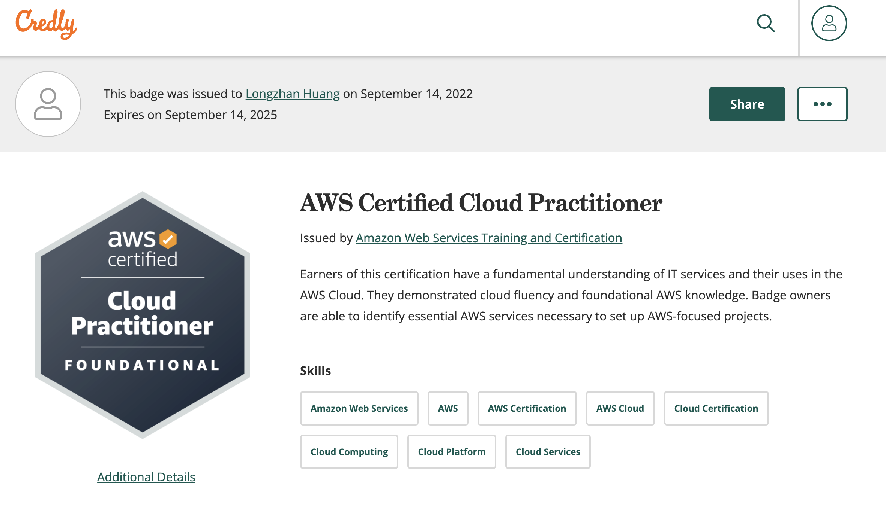
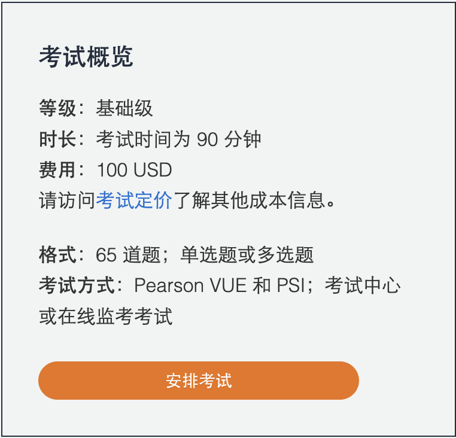
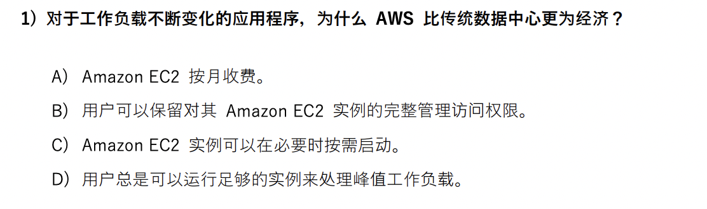
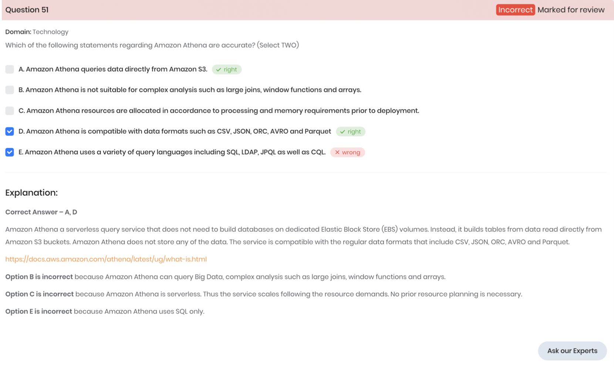
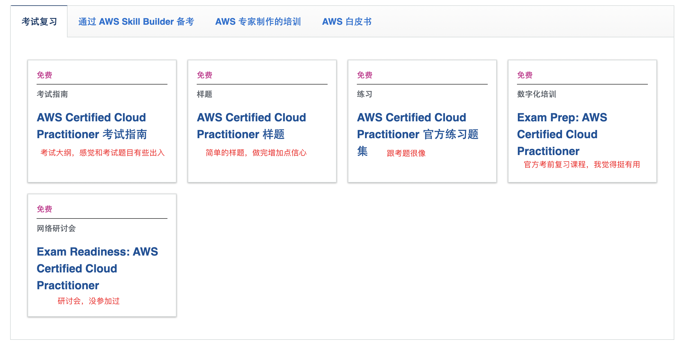
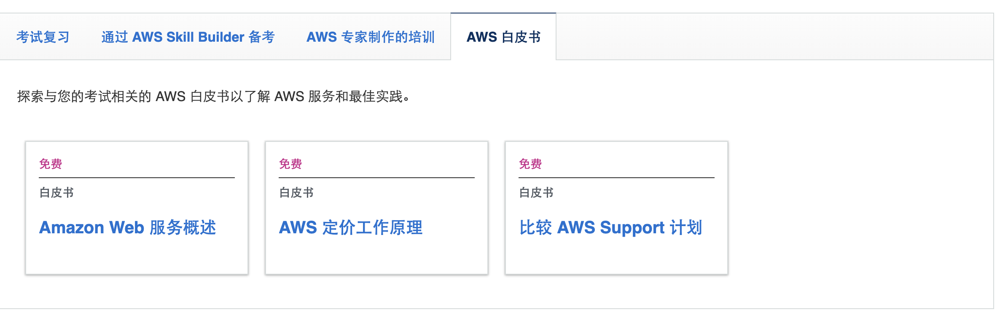
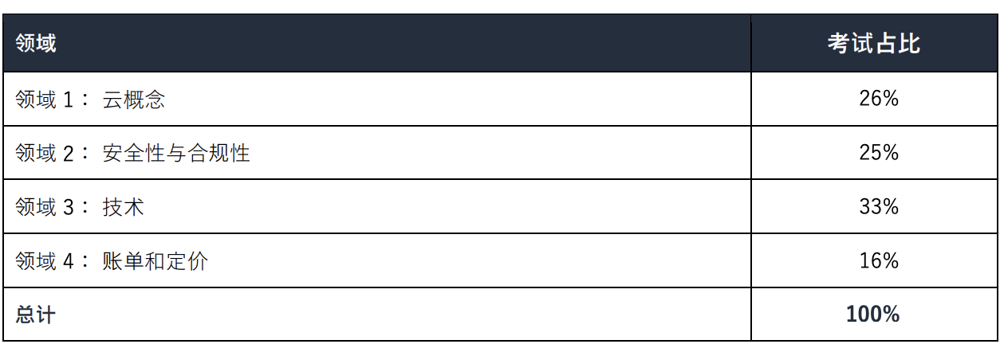
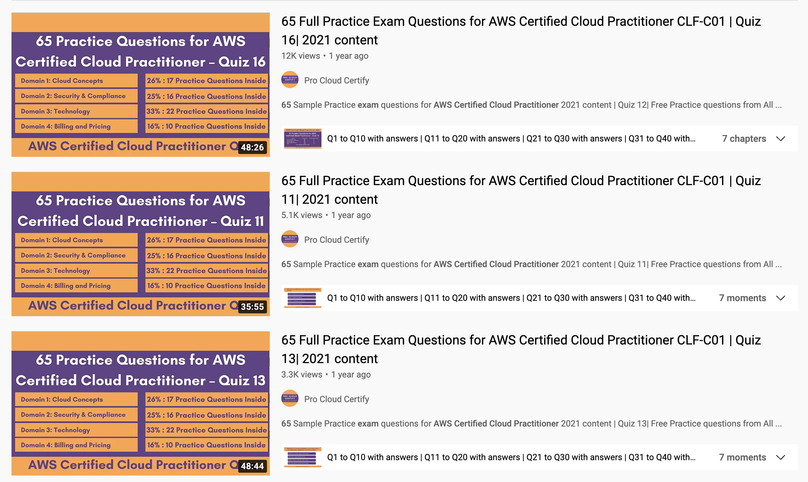

# AWS  Certified Cloud Practitioner ——备考心得

大家好~作为一个对云计算概念相对模糊的新手，我通过大约两周的准备，拿下了AWS Certified Cloud Practitioner。在备考难度，证书含金量上看，这个是一个性价比极高的考试。

考试需要自己在官网报名，可以选择线上或线下进行。考试完当场就可以得到结果。并在5天内（其实也就一两天）会收到考试通过的正式邮件，也可以到官网查看证书及考试分数报告。

邮件里也会提示，通过认证后会在credly收到一枚奖章。

好了。下面来具体说说考试的情况吧，以及给近期打算考试的小伙伴一些备考的建议~

# 1、考试介绍

AWS Certified Cloud Practitioner（CLF-C01），AWS云从业认证，是AWS近来新推出的入门级的考试，也是AWS所有考试中最简单的一门。AWS官方的说明是”AWS Certified Cloud Practitioner 适合具备 AWS 平台基础知识的任何人。“我认为这个认证非常适合想初步了解云计算的”小白“，以及工作内容与AWS相关的非IT从业者。

下面是****AWS Certified Cloud Practitioner官方介绍页****

[AWS Certified Cloud Practitioner 认证 | AWS 认证 | AWS](https://aws.amazon.com/cn/certification/certified-cloud-practitioner/)

在我看来，如果对云相关概念（什么是云计算，云计算的类型，常用云服务）及应用程序开发部署流程（基础服务设施）不太了解的人，来备考CLF-C01可能需要花较多的时间去理解。像之前大家如果有接触过各云服务器产商（如阿里云，腾讯云）的云服务，或者是有web应用程序的部署的经验，就可以与AWS对照着学习，会感觉学起来比较轻松。

# 2、考试形式

- 时长：90分钟。
- 方式：线上或线下（Pearson VUE和PSI两个产商提供）。
- 费用：100$。
- 题目：单选或多选（题目会告诉你选几项，一般是双选）。
- 语言：英文。可选中文（考试过程中还可以切换英文题目）。
- 通过条件：分数达到700分（总分1000），即正确率在70%以上就可以通过。（65道题大约答对45道题）

考试题目大概会是这样的。

### 单选题

### 多选题

# 3、备考

## 3.1 备考资料

[AWS Certified Cloud Practitioner 认证 | AWS 认证 | AWS](https://aws.amazon.com/cn/certification/certified-cloud-practitioner/)

在AWS考试介绍里有相关的备考资料。

还有几乎覆盖**所有考试内容**的AWS白皮书。

第一个是AWS的概述及服务的介绍。介绍了AWS的各个服务。相当于**”课本“**。

第二个是定价工作原理。里面的内容会比较细，考试可能不会考到特别具体的内容。

第三个是比较几个付费等级的AWS Support的不同。挺复杂的一个表格，一开始应该也记不住，我是大致浏览一下，通过刷题慢慢了解。也觉得够用了。

## 3.2 备考指南

### 3.2.1 考试内容

考试内容分为云概念，安全性与合规性，技术，账单和定价四部分。

> 来自：AWS Certified Cloud Practitioner (CLF-C01）考试指南
> 
> 
> 
> 
- 云概念领域（Cloud Concepts）：会问到AWS云计算的优势，云计算的良好架构。这部分在官方基础课程aws-cloud-practitioner-essentials基本都覆盖了。
- 安全性与合规性（Security and Compliance）：考试的内容基本上也是在官方基础课程aws-cloud-practitioner-essentials有提及。重点会在AWS shared responsibility model，几大监控服务（Amazon CloudWatch、AWS CloudTrail、AWS Config），权限管理IAM。
- 技术（Technology）：这部分主要问的是AWS的各个服务。不需要很具体地了解每个服务，知道服务大概是做什么的，在什么时候用基本上就能满足考试的要求了。所有的服务都在白皮书里。
    - AWS服务白皮书
    
    [Overview of Amazon Web Services](https://docs.aws.amazon.com/whitepapers/latest/aws-overview/introduction.html)
    
    ※ 特别提醒，在官方基础课程（aws-cloud-practitioner-essentials）出现的服务，是考试的重点。
    
- 账单和定价（ Billing and Pricing）：会问到几个价格管理相关的AWS服务（如AWS Cost Explorer，AWS Budgets）。也会问各种EC2类型，S3类型在某种场景下根据定价应该如何选择。

### 3.2.2 刷题

**1、ExamTopic（推荐）。**

总共约300道题。里面有很多考试原题。（免费用户只能刷到大概第150道题）

[Free & Accurate Amazon AWS Certified Cloud Practitioner Practice Questions | ExamTopics](https://www.examtopics.com/exams/amazon/aws-certified-cloud-practitioner/)

**2、Whizlabs。**

有一套免费的样题，还有付费的问题集。

[AWS Certified Cloud Practitioner - Whizlabs](https://www.whizlabs.com/aws-certified-cloud-practitioner/)

**3、youtube。**

youtube上会有很多刷题的视频。可以按需刷一刷。

## 3.3 备考总结

1、**（可选）**对于云概念不熟悉的小伙伴，可以选择先过一遍官方基础课程，看完基础课程便可以建立起一个对云概念的知识框架。而且里面基本上都是考试重点内容，虽然覆盖率才能只有80%。

2、**（必选）**对着三大白皮书，像是课本，再完善一下基础。到这里基本上覆盖了95%的考试内容。

3、**（可选）**官方的考试复习课。算是对考试的指导和总结，对考试有一定帮助。

[Self-paced digital training on AWS - AWS Skill Builder](https://explore.skillbuilder.aws/learn/course/external/view/elearning/9449/exam-prep-aws-certified-cloud-practitioner-foundations)

3、**（必选）**刷题。刷完题就知道考试大概会考什么了，通过刷题驱动复习也是挺高效的。因为这考试是重概念的，所以刷题刷到相似的题目甚至原题的概率很高。

# 4、其他Q＆A

### 1、备考时长是多少？

我觉得2~4周是一个不错的选择。备考时间大概是50h。

### 2、选择线上考试还是线下考试？

考试分为线上和线下两种。在官网预约考试的时候都可以自由选择，里面也给出了比较详细的介绍。

线上考试比较麻烦的是需要准备考试环境，考试前拍摄考试周围环境。可能会出现一些不稳定的问题。

线下考试在指定考点，到达之后携带证件进入。需要提供两种形式的身份证件。

- 一种必须是政府签发的最新有效的身份证件，其上有您的签名、法定全名和照片。
- 另一个次身份证件必须有您的签名和法定全名。如信用卡、银行卡或员工卡。

实际上可能没有这么严格，但还是带上以防万一。

所以我觉得有条件去线下考试的还是会比较方便一些，也可以避免线上考试出现的环境问题。

### 3、考试结果什么时候收到？

考试提交后当场就会显示是否通过喔。并提示5天内会收到邮件，我大概2天后就收到了。然后就可以到[AWS Training & Certification](https://www.aws.training/Account/SessionTimedOut?returnUrl=https%3A%2F%2Fwww.aws.training%2FCertification)下载证书和考试分数报告了。

总之，AWS Certified Cloud Practitioner是性价比超高的考试，非常推荐大家去考。考完还有下场考试半价的权益的额外权益。

大家加油，祝大家考试通过~